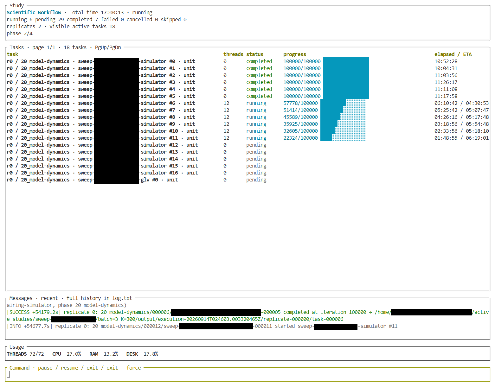

# Scientific Workflow

**Focus on science itself.**

Scientific computing can feel like spending 90% of your time fighting computer
systems: wiring programs together, implementing I/O, assembling Cartesian
products of parameters, tracking runs, and getting results into visualization tools.

Scientific Workflow takes that infrastructure work off your hands. Once your
scientific models and analysis components are integrated, define sweeps,
replicates, dependencies, recording, and analysis pipelines in JSON—without
writing custom orchestration code for each study.

**Write your science. Let Workflow handle the experiment around it.**

> **Breaking generation: Rust 0.15.0 / Python 0.5.0** supersedes the Rust 0.14.x /
> Python 0.4.x runtime-policy generation. No compatibility aliases restore the old
> execution names or JSON rewrite behavior. Rust 0.15.1 retains this generation;
> scientific APIs and recording formats 7/8 remain compatible. Read the
> [migration guide](docs/migration-0.15.0.md) before upgrading.

## Describe your study. Let AI configure it.

> “Sweep these two parameters, run five replicates per combination, convert the
> recordings to NumPy, and run our plotting script.”

Once your project is properly set up, an AI assistant can translate requests
like this into documented JSON using your registered models and existing
analysis components. Routine study changes become configuration edits, reducing
the Rust and Python an agent must generate, inspect, and debug—and the tokens
spent doing so.

**More scientific iteration. Less infrastructure code. Less AI context to maintain.**

New scientific models and analysis algorithms still need implementation. The
[AI-assisted studies guide](docs/guide/12-ai-assisted-studies.md) shows how
to set up reusable components so later experiments can stay in configuration.

*Live progress, compute allocations, messages, and resource usage across a study.
Some project names and paths are redacted.*

## From a model to an experiment

**Initialization → simulation sweep → NumPy conversion → Python analysis**

- **Explore parameter spaces:** declare Cartesian sweeps, correlated cases, and
  replicates without manually enumerating tasks.
- **Connect computation and analysis:** combine registered Rust execution units,
  executable programs, and Python scripts through phase dependencies.
- **Record scientific state automatically:** retain typed member recordings for
  verified reading and NumPy conversion.
- **Reuse completed prerequisites:** select compatible completed work when
  rerunning downstream phases.
- **Follow long experiments:** inspect progress, thread allocations, resource
  usage, and logs in a live terminal dashboard.

## See it work

- [First population study](docs/guide/3-first-study.md): a complete minimal model
  with automatic recordings and a verified final result.
- [Population visualization](docs/guide/9-python-analysis-and-visualization.md):
  turn parameter sweeps into plotted results.
- [Dependency pipeline](examples/dependency_pipeline/README.md): initialization,
  simulation, NumPy conversion, and Python analysis.
- [Two-dimensional attractor](examples/attractor_2d/README.md): a larger model
  with swept tasks and visualization.

## Get started

**[Read the numbered guide](docs/guide/1-overview.md)** ·
**[Install Workflow](docs/guide/2-installation.md)** ·
**[Documentation index](docs/README.md)**

Already have an integrated project? Start with
[parameter sweeps](docs/guide/7-parameter-sweeps-and-replicates.md) or
[AI-assisted studies](docs/guide/12-ai-assisted-studies.md).

**Requirements:** Linux, Rust 1.97+, and an interactive terminal dashboard.
Python conversion and companion utilities require Python 3.14+ and companion 0.5.0.

## Explore the project

| Component | Where to go |
| --- | --- |
| Rust crate and `study.json` reference | [Crate README](rust/README.md) · [Rustdoc](https://docs.rs/scientific-workflow) |
| Python readers and conversion | [Python package](python/README.md) |
| Scientific examples | [Example index](docs/examples.md) |
| Architecture and API contracts | [Development documentation](docs/README.md#development) |
| Formats and compatibility | [Protocol compatibility](protocol/compatibility.md) |
| Releases and migration | [Changelog](CHANGELOG.md) · [Migration guide](docs/migration-0.15.0.md) |

## Project status and license

Scientific Workflow is pre-1.0 software. Review migration notes before upgrading.
Licensed under [MIT](rust/LICENSE).
